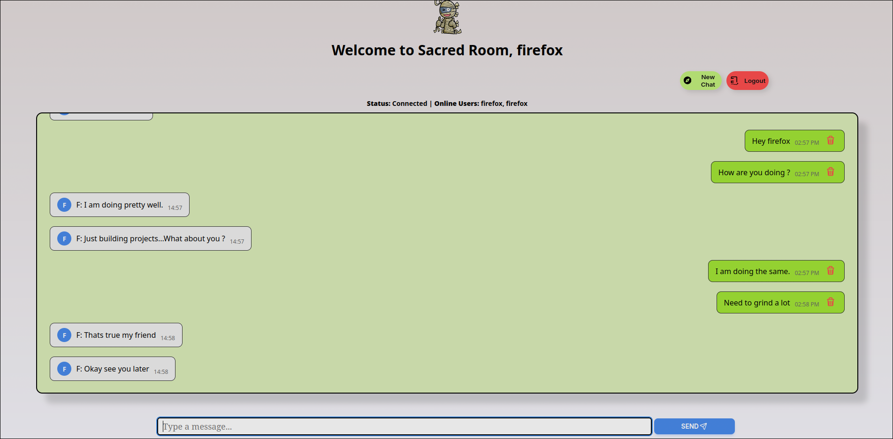

# Sacred Room Chat Application

Overview

Sacred Room is a real-time chat application that allows multiple users to communicate in a group chat environment. Users can join the chat, send messages, see who is online, and receive notifications when others are typing or join/leave the chat. The application features a clean, responsive UI and supports persistent chat history stored locally in the browser.

Screenshot

## Features

Real-Time Messaging: Send and receive messages instantly using WebSocket technology.

Typing Indicators: Displays a single "is typing..." message for one or multiple users typing simultaneously.

User Presence: Shows a list of online users and notifies when users join or leave the chat.

Persistent Chat History: Messages are stored locally in the browser's localStorage for each user.

Message Deletion: Users can delete their own messages from the chat.

##  Technologies Used

## Frontend:

HTML5: Structure of the web pages.

CSS3: Styling with custom animations and responsive design using media queries.

JavaScript: Client-side logic for handling user interactions and WebSocket communication.

Socket.IO (Client): Enables real-time, bidirectional communication between the client and server.

Font Awesome: Provides icons for the login form.

## Backend:

Node.js: Runtime environment for the server.

Express.js: Web framework for handling HTTP requests and serving static files.

Socket.IO (Server): Manages WebSocket connections for real-time chat functionality.

## Other:

LocalStorage: Stores chat history and user data on the client side.

WebSocket/Polling: Ensures reliable real-time communication with fallback to HTTP polling.

## Prerequisites

Node.js: Version 14.x or higher.

npm: Node package manager (comes with Node.js).

Built with ❤️ by Sulab Nepal.

Powered by Socket.IO for real-time communication.

Icons by Font Awesome.
